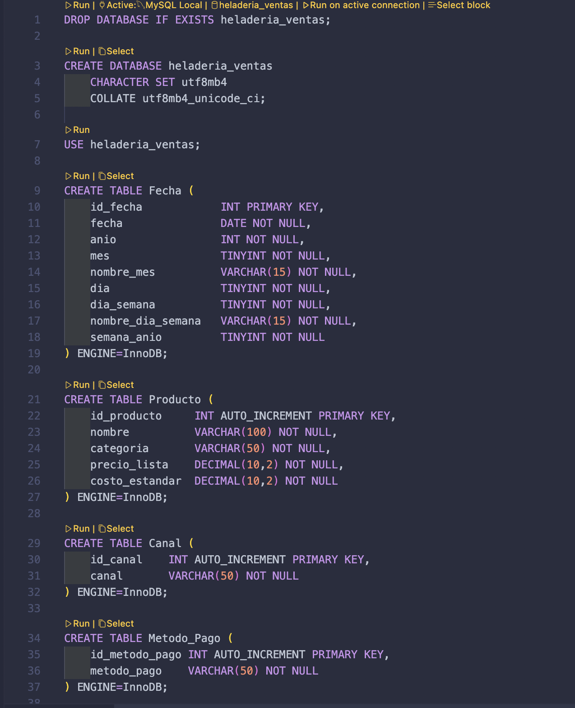
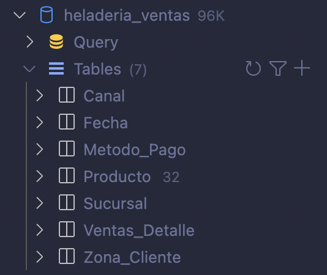
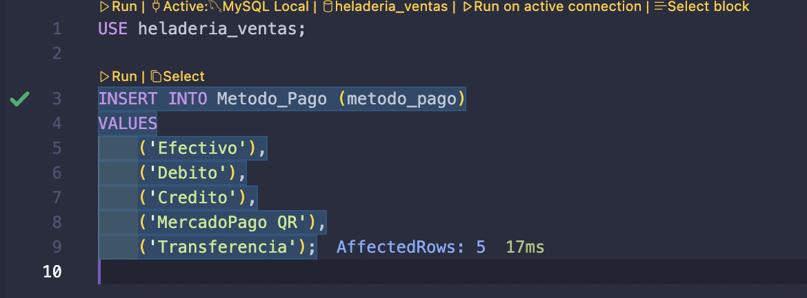
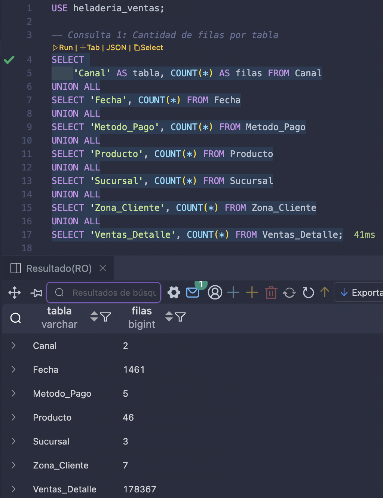
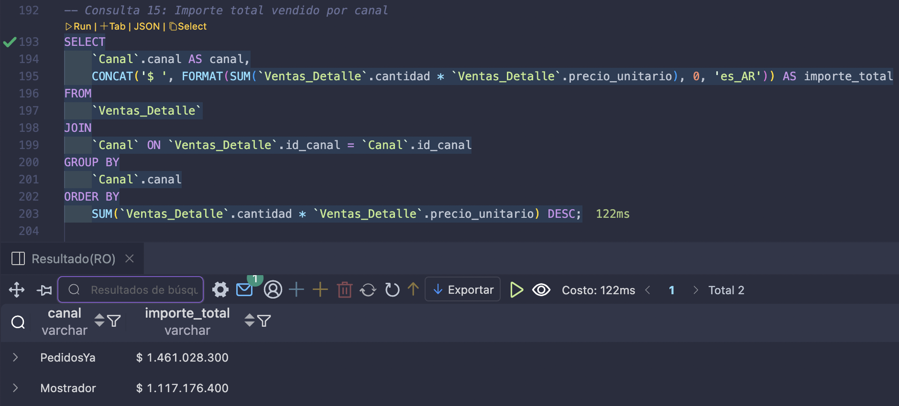
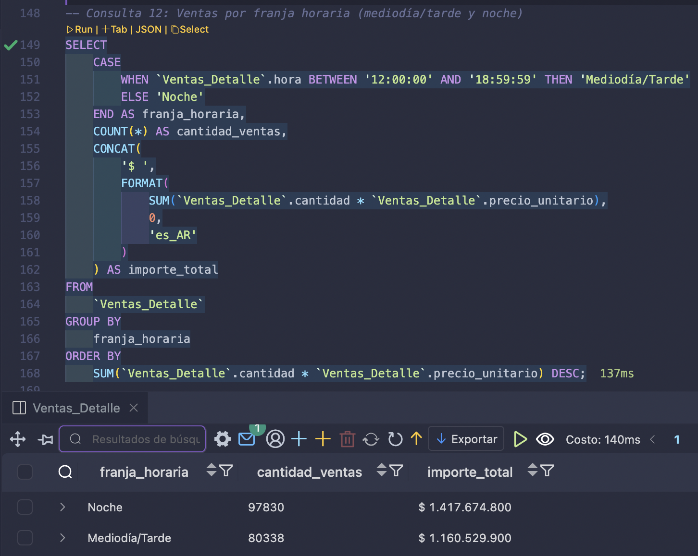
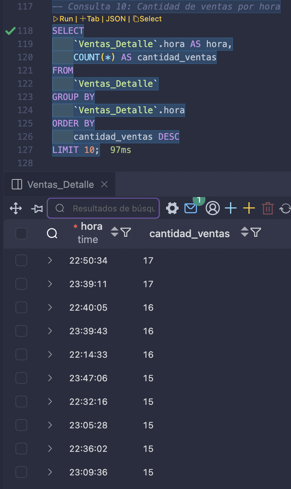
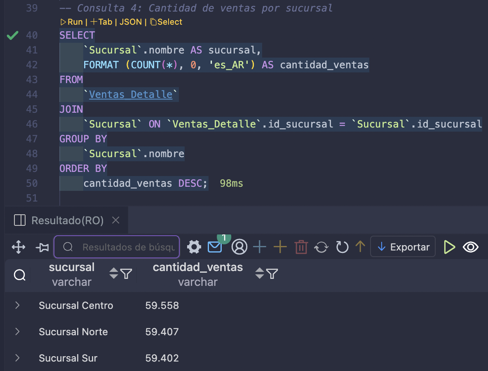
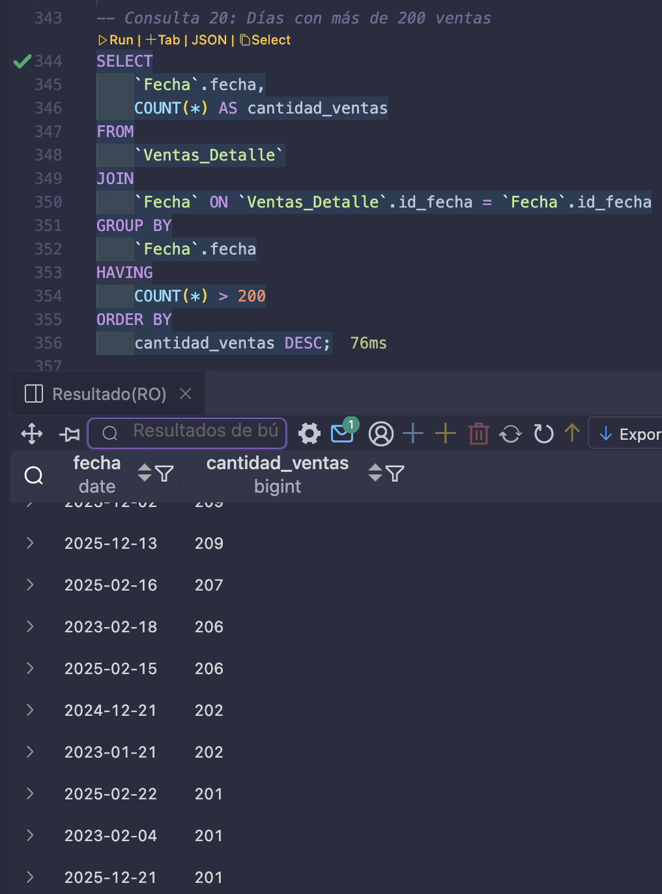

# 🛢️ sql_heladeria_ventas

Proyecto SQL orientado al análisis comercial de una heladería con múltiples sucursales.  
Incluye la creación completa del esquema de base de datos, carga inicial de datos y consultas diseñadas para explorar ventas, productos, márgenes, estacionalidad y desempeño por sucursal.

---

## 🗂 Estructura del proyecto

```
sql_heladeria_ventas/
│
├── setup/                     # Scripts para crear la base desde cero
│   ├── 01_schema.sql
│   ├── 02_seed_canal.sql
│   ├── 03_seed_metodo_pago.sql
│   ├── 04_seed_sucursal.sql
│   ├── 05_seed_zona_cliente.sql
│   ├── 06_seed_producto.sql
│   ├── 07_seed_fecha.sql
│   └── 08_seed_ventas_detalle.sql
│
├── 01_exploracion_inicial.sql
├── 02_analisis_ventas.sql
└── README.md

```

---

## 🚀 Cómo usarlo

### 1. Crear el schema en MySQL

```sql
CREATE DATABASE heladeria_ventas;
USE heladeria_ventas;
```

### 2. Ejecutar los scripts de la carpeta `/setup` en orden  
Esto crea todas las tablas y carga los datos iniciales.

### 3. Ejecutar los análisis

- `01_exploracion_inicial.sql` → análisis básico, exploración y estructura  
- `02_analisis_ventas.sql` → métricas comerciales (ticket promedio, márgenes, estacionalidad, rankings, etc.)

---

## 📸 Capturas del proyecto

### Diagrama entidad–relación


### Creación de tablas


### Relaciones entre tablas


### Tablas creadas


### Carga de productos


### Exploración inicial


### Importe vendido por canal


### Ventas por franja horaria


### Ventas por hora


### Ventas por sucursal


### Días con más de 200 ventas

